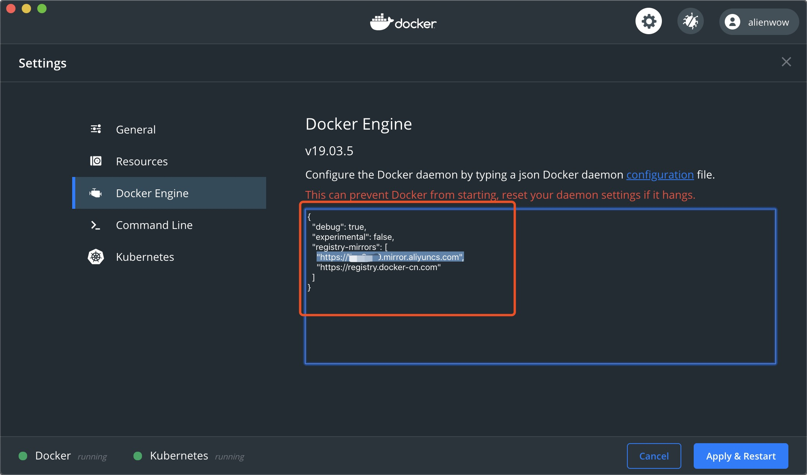
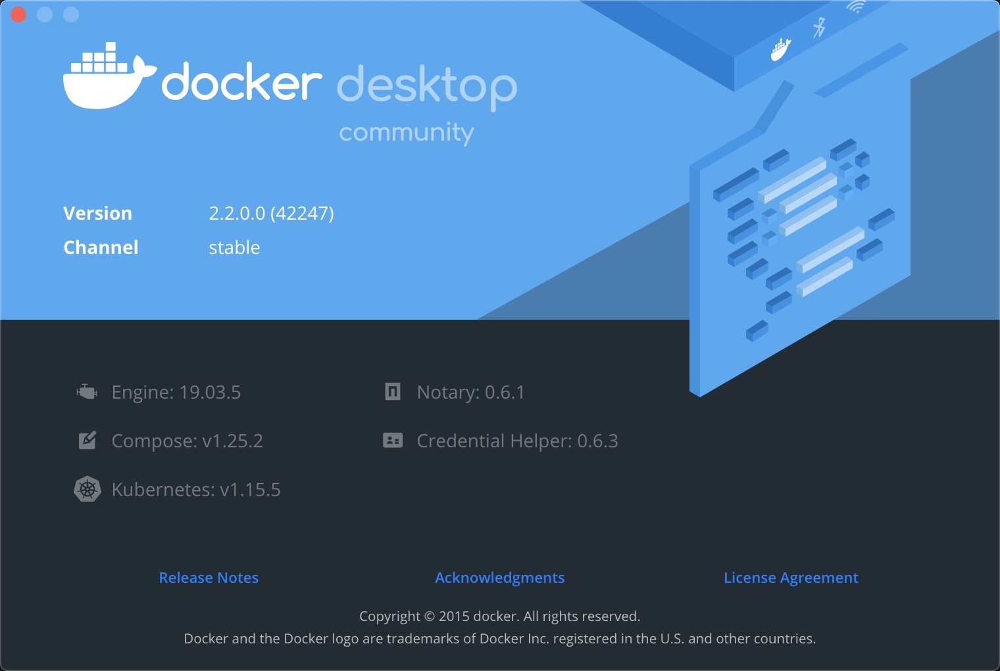
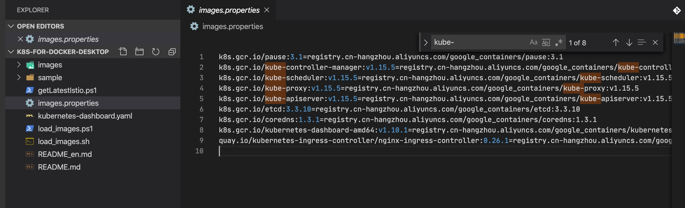
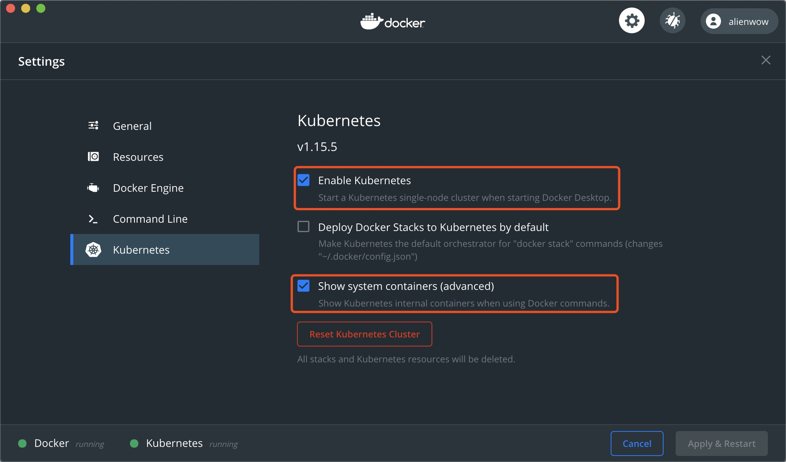

# docker-for-mac 启用 kubernetes

https://github.com/AliyunContainerService/k8s-for-docker-desktop

## 准备工作

1. 安装 docker for mac

    docker for mac 的安装方式就不赘述了；

1. 配置仓库镜像

    默认的 docker 镜像仓库部署在国外下载速度很慢，所以需要使用
    [`阿里云镜像` 服务](https://cr.console.aliyun.com/cn-hangzhou/instances/mirrors)
    或 `中科大镜像` 加速地址 [https://docker.mirrors.ustc.edu.cn](https://docker.mirrors.ustc.edu.cn)

    在这里我使用阿里云镜像加速服务，最终按下图设置，然后点 `【Apply & Restart】` 按钮保存并重启；

    

1. 查看当前 docker 下指定的 kubernetes 版本

    如下图，可以看到当前所指定的 kubernetes 版本为 v1.15.5，我们先记下这个版本，后面会用到；

    

## 下载镜像

### 下载 k8s 镜像

默认的 k8s 镜像存储在 google 的服务下，由于 GFW 的原因无法下载镜像，所以下面我们需要手动下载 k8s 镜像到本地

下载仓库构建代码

```bash
git clone https://github.com/AliyunContainerService/k8s-for-docker-desktop.git
```

检查仓库下 `images.properties` 文件中 `kube-controller-manager`、`kube-scheduler`、`kube-proxy`、
`kube-apiserver` 四个镜像的版本是否是第一节中找到的 kubernetes 版本即 `v1.15.5`，如果不是则改成对应版本



加载镜像

```bash
./load_images.sh
```

## 启用 kubernetes

按如下图设置，然后点 `【Apply & Restart】` 按钮保存并重启；



如果在Kubernetes部署的过程中出现问题，可以通过docker desktop应用日志获得实时日志信息：

```bash
pred='process matches ".*(ocker|vpnkit).*"
  || (process in {"taskgated-helper", "launchservicesd", "kernel"} && eventMessage contains[c] "docker")'
/usr/bin/log stream --style syslog --level=debug --color=always --predicate "$pred"
```

至此已经成功在 docker for mac 上启用 kubenetes。
