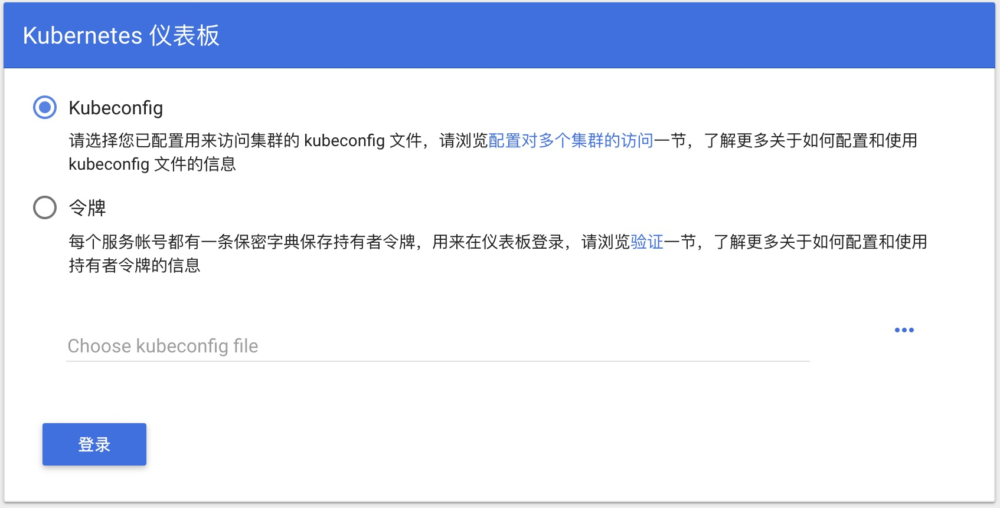

# 配置 Kubernetes

## 配置 .kube/config

## 配置 Kubernetes 控制台

### 部署 Kubernetes dashboard

```bash
kubectl apply -f https://raw.githubusercontent.com/kubernetes/dashboard/v1.10.1/src/deploy/recommended/kubernetes-dashboard.yaml
```

或

```bash
kubectl create -f kubernetes-dashboard.yaml
```

开启 API Server 访问代理

```bash
kubectl proxy
```

通过当前 [URL](http://localhost:8001/api/v1/namespaces/kube-system/services/https:kubernetes-dashboard:/proxy/#!/overview?namespace=default) 访问 Kubernetes dashboard

### 配置控制台访问令牌

```bash
TOKEN=$(kubectl -n kube-system describe secret default| awk '$1=="token:"{print $2}')
kubectl config set-credentials docker-for-desktop --token="${TOKEN}"
echo $TOKEN
```

登录 dashboard 的时候



选择 `令牌` 登录，输入上文控制台输出的内容

```bash
```
